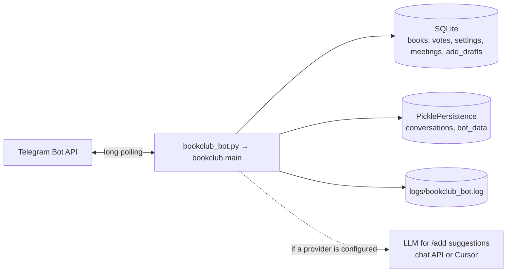
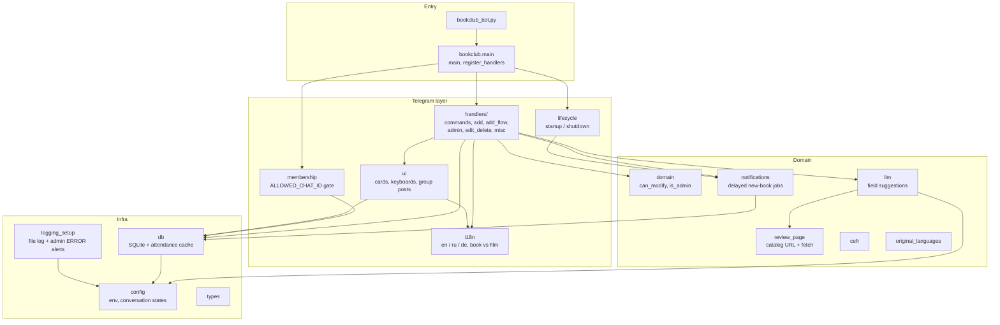
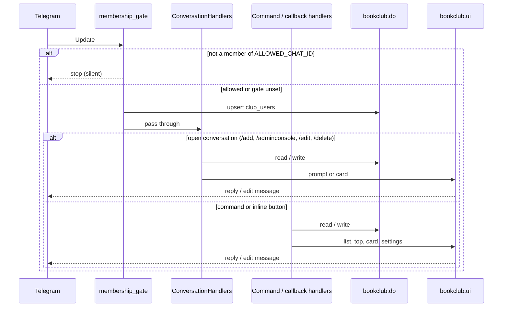
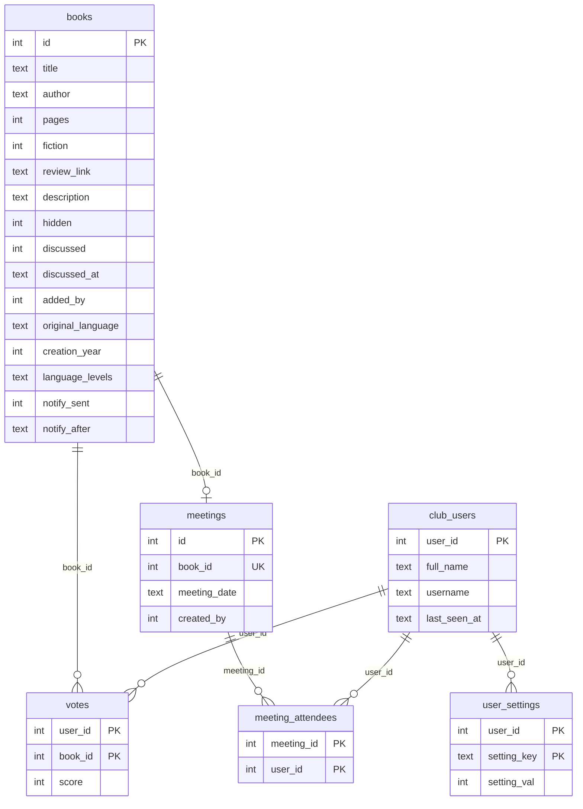

# Architecture

This bot is a **single-process, long-polling** Telegram app (Python 3.11). There is no inbound HTTP API: Telegram is polled, state lives on disk, and one process owns the SQLite file.

Implementation lives in the `bookclub/` package. `bookclub_bot.py` re-exports that public API so tests and deploy scripts can keep `import bookclub_bot`.

## Runtime

Locally: `python bookclub_bot.py`. In production: `docker compose up` binds `./data` (DB + persistence) and `./logs`.

Startup in `bookclub.main.main()`:

1. Fail fast if `BOT_TOKEN` is missing.
2. `init_db()` — create/migrate tables, rebuild attendance surplus.
3. Build a `python-telegram-bot` `Application` with pickle persistence, `post_init` / `post_stop` hooks, then `register_handlers()` and `run_polling()`.

## Package map

| Module | Role |
|--------|------|
| `bookclub/main.py` | Application wiring: conversation handlers, commands, callbacks, error handler. |
| `bookclub/handlers/commands.py` | `/start`, `/help`, `/info`, `/list_and_vote`, `/top`, `/settings`, `/discussed`. |
| `bookclub/handlers/add.py` | `/add` step handlers and AI-or-manual choice. |
| `bookclub/handlers/add_flow.py` | Add-wizard step order, back/forward, prompts. |
| `bookclub/handlers/admin.py` | `/adminconsole`: discussed, hide, reminders, meetings, export/import, vote-counting mode. |
| `bookclub/handlers/edit_delete.py` | `/edit` and `/delete` (owner or admin). |
| `bookclub/handlers/misc.py` | `/cancel` and inline `vote_cast` callbacks. |
| `bookclub/membership.py` | Silent membership gate; stamps `last_non_admin_activity` for deploy idle checks. |
| `bookclub/lifecycle.py` | Command menus, recover pending notify jobs, admin start/stop DMs. |
| `bookclub/ui.py` | Book cards, vote keyboards, compact lists, group-chat voting posts. |
| `bookclub/i18n.py` | Strings plus `CLUB_ENTITY` overlays (`book` / `film`). |
| `bookclub/domain.py` | Who may edit/delete a book. |
| `bookclub/db.py` | SQLite access, ranking scores, attendance surplus cache. |
| `bookclub/notifications.py` | 5-minute delayed new-book DMs and optional group posts. |
| `bookclub/llm.py` | OpenAI-compatible Chat Completions for `/add` field guesses. |
| `bookclub/review_page.py` | Catalog URL lookup and fetch/verify of review pages during `/add`. |
| `bookclub/config.py` | Env (`BOT_TOKEN`, `ADMIN_IDS`, `ENTRY_FIELDS`, …) and conversation-state ints. |
| `bookclub/logging_setup.py` | Rotating file log; coalesced ERROR alerts to the main admin. |

Supporting lookup tables: `cefr.py`, `original_languages.py`. Tests import the same surface via `bookclub_bot`.

## Update pipeline

Every Telegram update hits this stack. `membership_gate` runs in handler group `-1`, before conversations and commands.

`register_handlers()` order (after the gate):

1. Conversations: `/add`, `/adminconsole`, `/edit`, `/delete` (each with `/cancel` fallback and `allow_reentry=True`).
2. Commands: `/start`, `/help`, `/info`, `/list_and_vote`, `/settings`, `/top`, `/discussed`.
3. Callbacks: list format, settings toggles, inline votes, score-explanation popup.
4. Global `error_handler` so crashes produce a reply instead of silence.

## Data model

SQLite path: `DB_PATH` (default `bookclub.db`; in Docker `/app/data/bookclub.db`).

Notes:

- Vote `score` is `-1` / `0` / `1` (don't want / don't care / want). Rankings use the **sum**.
- Admin flags (`post_new_books_to_chat`, `votes_use_attendance`) are rows in `user_settings` with `user_id = 0`.
- Attendance surplus is an in-memory cache rebuilt at startup, when a meeting is recorded or deleted, and when the club calendar date changes. Future-dated meetings are ignored until that date. Each book has at most one meeting (`UNIQUE` on `meetings.book_id`); saving attendance again replaces the attendee list.
- Pickle persistence holds conversation state and `bot_data["last_non_admin_activity"]` (used by `scripts/deploy_bots.sh` idle checks). It is not a second source of book data.

## Notable flows

**`/add`:** optional start (AI vs manual vs continue a saved draft) → title → optional similar-title confirm → review link (when enabled) → remaining `ENTRY_FIELDS` → a full-entry preview where the user can go back to edit a field or confirm the add. Unfinished adds can be saved to SQLite (`add_drafts`) and resumed later; AI-suggested fields stay marked unless the user edited them. AI looks up a real catalog URL (Wikipedia / Google Books / Open Library, then a fetched LLM candidate) and, after the user confirms it, reads the other fields — including page count / runtime — from that page. AI uses `bookclub.llm` only when an API key is configured. Text fields with a saved or suggested value include an **Edit** button; sending a new value replaces it. After insert, `notifications.schedule_new_book_notifications` writes `notify_after` and queues a JobQueue task (recovered on restart).

**Voting:** inline buttons on cards (`vote_cast:`). Works in DM and in the group chat; the message is edited so everyone sees the new tally.

**Access:** if `ALLOWED_CHAT_ID` is set, non-members are dropped before handlers. The bot must be in that chat. API failures fail *open* so a misconfigured group ID does not lock everyone out.

**Deploy:** each instance is its own `docker compose` stack. `scripts/deploy_bots.sh` pulls and rebuilds idle instances; `scripts/logs.sh` greps across `DEPLOY_REPOS`.
